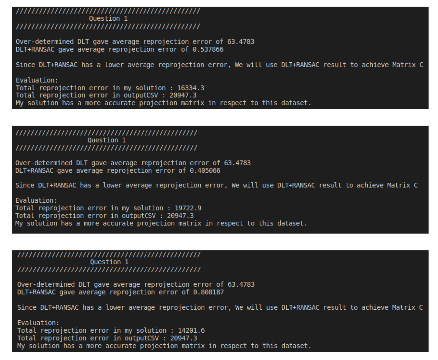

# DirectLinearTransform_Eigen

## How to use

```bash
mkdir build
cd build 
cmake ..
make
```

## Purpose

This repository contains an implementation of **Direct Linear Transform (DLT) algorithm**, based on using [Eigen](https://www.google.com/search?client=safari&rls=en&q=eigen3&ie=UTF-8&oe=UTF-8). The code also uses [fast-cpp-csv-parser](https://github.com/ben-strasser/fast-cpp-csv-parser) library to read input data file.

The DLT algorithm is implmented in 2 styles:

- Minimal DLT solver (6 correspondences) + standard RANSAC
- Over-determined DLT solver

I implemented this code as a part of coding interview.

## Problem statement

Below is the breakdown of the original problem.

Given the 2 types of data:

- 30 x 2D data points, expressed in camera pixel coodinates $[u,v]^T$
- 30 x 3D data points of the marker positions, expressed in 3D Euclidean coodinates $[x,y,z]^T$

Find the 3D transformation between the object and the camera.

## Approach

I have made 2 assumptions to solve this problem:

- The given 3D marker positions are already converted to be expressed by the world space frame (instead of the raw data format usually given from the positional tracker's frame).
- The 2D data points and the 3D data points are listed by their correspondences.

With the given 2D-3D correspondence data, the problem turns into a
Perspective-n-Points problem. There are many approaches to solve this
problem:

1. `minimal P3P solver + RANSAC`
2. `minimal DLT solver + RANSAC`
3. `Over-determined DLT`

During the interview, I was told not to take the minimal P3P solver + RANSAC approach despite being the most accurate and efficient, as the implementation is trivial due to well-known OpenGV implementation.

Therefore, in this code the minimal DLT solver + RANSAC and Over-determined DLT are implemented and compared to each other.

### Over-determined DLT

This method minimises $\lvert\lvert{Bp}\rvert\rvert^2$ such that $\lvert\lvert{p}\rvert\rvert=1$. To minimise $\lvert\lvert{Bp}\rvert\rvert^2$, the system of linear equations must be an over-determined system, which means more than 12 equations are required. This basically turns the problem into a least-squares problem, whilst performing SVD in a large matrix to calculate $P$ matrix. The $P$ matrix is already optimised to all data points over least-squares cost function, however it can be further optimised with another robust estimator again in Gauss-Newton algorithm. This method is expected to perform well under the assumption there is no outlier in the dataset.

### Minimal DLT solver + RANSAC

This method formulates the problem as $Bp = 0$ , and uses singular value decomposition (SVD) to calculate the projection matrix $P$. We need 12 observation equations in the $B$ matrix, which means 6 correspondences are required. Considering the chances of errors and outliers present in the given dataset, we use RANSAC framework to reject the data and achieve the best model parameter. The model paramater can then be further optimised using Gauss-Newton algorithm.

## Implementation

- Data points are read from `input.csv`, using the `CSVParser` class which is a wrapper of the fast-cpp-csv-parser library. The 2D and 3D data points are stored in `imgCoords` and `posMarkers` variables respectively.
- `DLT` class is constructed, and then `DLT.run()` is called.
- Inside the `run()` function, we first perform over-determined DLT via `doOverDeterminedDLT()`.
  - First, we create a large $B$ matrix, sizing 60 x 12. Then we use the `imgCoords` and `posMarkers` data to fill in the $B$ matrix in the form of system of linear equations. The shape of system of linear equations is shown below\
  - $\begin{bmatrix} X,-Y,-Z,-1,0,0,0,0,uX,uY,uZ,u \newline 0,0,0,0,-X,-Y,-Z,-1,vX,vY,vZ,v \end{bmatrix}$
  - Then, we perform singular value decomposition (SVD) to extract $p$ vectors. As the $B$ matrix is large, we use the BSD-SVD algorithm which is pre-implemented in the Eigen library to efficiently perform SVD. The BSD-SVD algorithm is faster than the usual Jacobi-SVD when used on large matrices. We use the option `ThinU` and `ThinV` computation to speed up the calculation, which gives us all the information to solve the least-squares problem without computing all the elements in the $UDV^T$ .
  - We take the last column vector of the $V^T$ matrix, which has the $p$ vectors. Then, we reshape the vector into a 3x4 matrix form.
  - We evaluate the result by computing the average reprojection error. The reprojection error is computed as $([u,v]^T-P[X,Y,Z,1]^T)^2$. We sum all the reprojection errors by each data point, then we divide it by the total number of data points (i.e. 30), to achieve average reprojection error.
- We then calculate P matrix using minimal DLT solver + RANSAC approach. This runs within the `doRANSACDLT()` function. The result of DLT+RANSAC will be compared with the over-determined DLT, and the better one will be used in the end.
  - First, we set the RANSAC configurations. I've set the maximum iteration of RANSAC to be 1000. This is just an arbitrary number, and I hope it finishes before the 1000th iteration. We also consider the outlierThreshold as 3.0 pixels. We terminate RANSAC early when we found at least 10 inliers and the average reprojection error is below 5.0 pixels. We also terminate RANSAC if the model finds the same results for 200 times in a row. The values used here are heuristics but are referenced from past experiences.
  - We create a $B$ matrix, sizing 12 x 12. This makes sure that $Bp=0$ is formed, such that a closed-form solution can be derived from the null-space (i.e. no least-squares are involved). We use the random integer generation to generate a random index and make sure that no duplicate indices are selected to avoid rank deficiency.
  - We again use SVD, but this time with the Jacobi-SVD algorithm. As the matrix is smaller, the Jacobi-SVD algorithm runs faster than the BSD-SVD algorithm.
  - We evaluate the average reprojection error like before. We then save the model parameters as the best model to use in the RANSAC framework. We then repeat the process until we reach RANSAC termination.
- At last, we compare ther results of the over-determined DLT approach and the minimal DLT solver + RANSAC approach, and pick the better one.

## Results

During the coding interview, I was asked to beat the result made by the interviewer. His approach had total reprojection error around 20,000 over all data points (i.e. including the outliers). I have cut out the code to evaluate my approach against the interviewer's approach, but here's the results below.



## What I can do better next time

- Tidy up the code.
  - The code was rushed to be implemented, and the code quality is unsatisfactory to be shared with any  collaborator. 
  - Most of all, the code implementation is all written in the .hpp file.
- Implement a better RANSAC algorithm. Due to time constraint, I could only implement standard RANSAC in a rough sketch, which has little consistency over multiple runs, and is very inefficient. I'll probably write a Lo-RANSAC algorithm with non-linear optimsation and M-estimators to accelerate ransac procedure.
- Implement non-linear optimisation algorithms. Both miniaml DLT solver + RANSAC and Over-determined DLT will only give an initial guess, which can be greatly improved by optimisation methods such as Gauss- Newton or Levenberg-Marquardt algorithms. These were not implemented due to time constraint.
